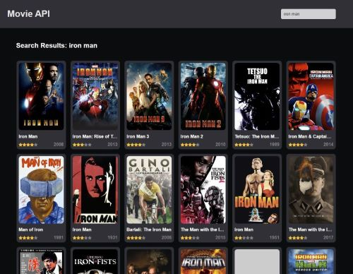

# Movie Search Web App

The Movie Search Web App is a simple web application built using HTML, CSS, and JavaScript that allows users to search for movies using [The Movie Database (TMDb)](https://www.themoviedb.org/) API. To use this application, users must register on the TMDb website and generate an API key.



## Features

Search for movies by title.
Display movie posters, released year and star rating.
Utilizes The Movie Database (TMDb) API for movie information.

## Getting Started

Before using the Movie Search Web App, register on TMDb: Go to The Movie Database (TMDb) and create an account if you haven't already.

Generate an API Key:
1. Log in to your [TMDb](https://www.themoviedb.org/) account.
2. Go to the "Settings" section of your account.
3. Click on the "API" tab.
4. Scroll down and click on "Create" to generate a new API key.
5. Copy the generated API key and API Token for use in your web app.

## Usage

Clone this repository to your local machine.

Create a new file api_key.js in the project directory.
Add following code to a file and replace values to your data:

```js
const API_KEY = 'YOUR_API_KEY';
const API_AUTH = 'Bearer YOUR_API_API_Read_Access_Token'
```

Open the index.html file in your web browser to start using the Movie Search Web App.

In the app, you can:

* Enter a movie title in the search bar and press "Search" to retrieve movie information.
* Explore movie poster, including title, release date, and star rating.

# License

This project is licensed under the MIT License.
